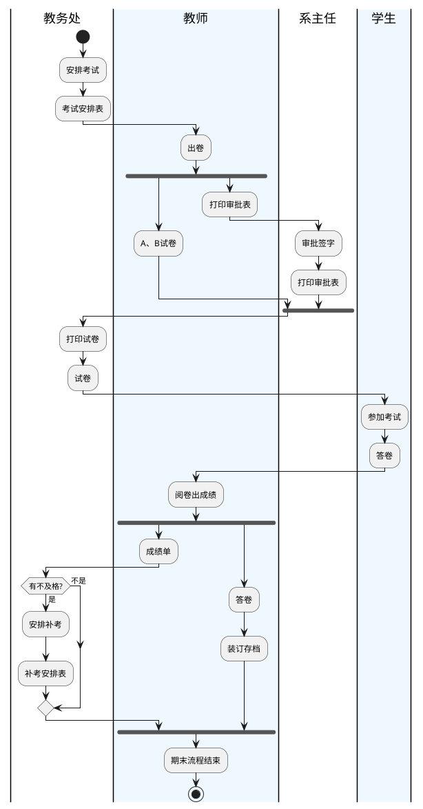
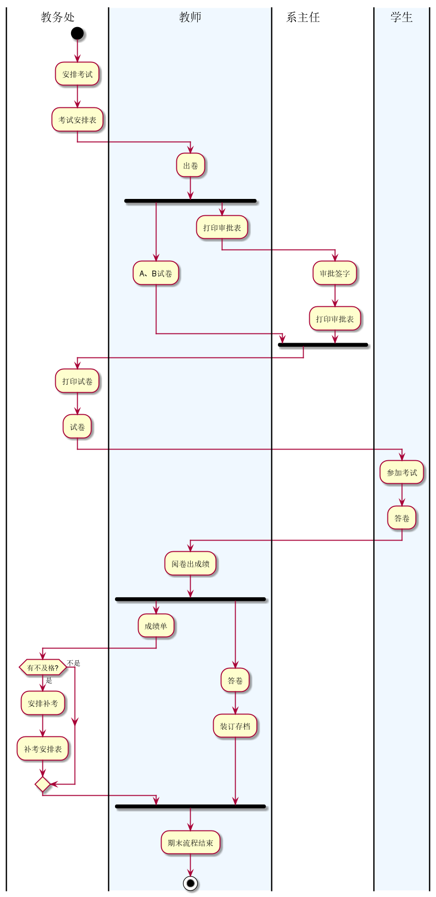
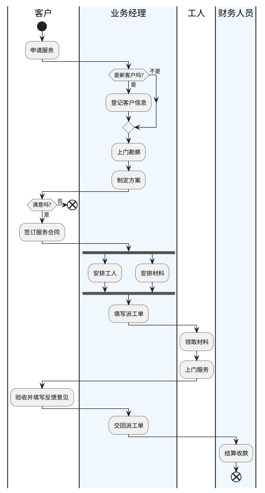
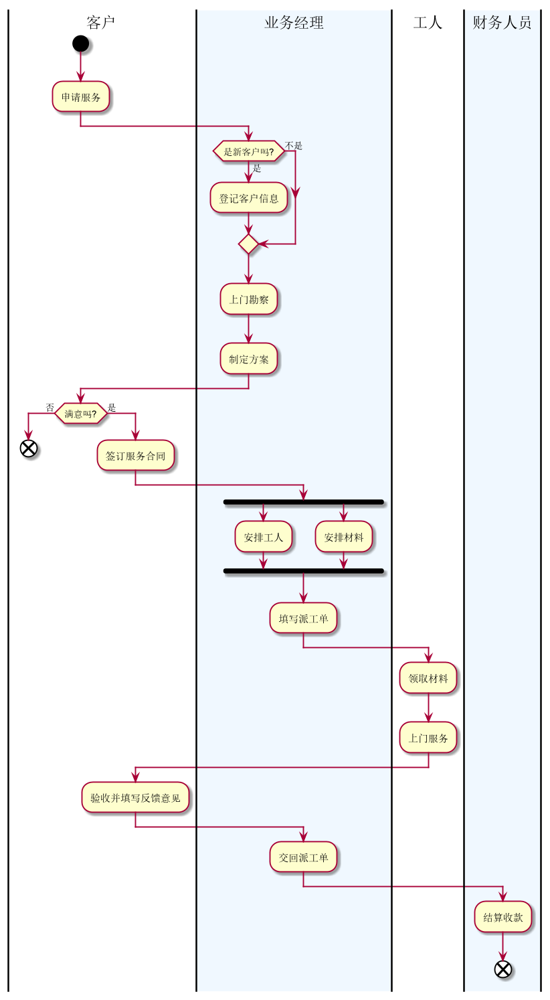

# 实验1：业务流程建模
学号|班级|姓名
:-------:|:-------:|:-------:|
201710414226|2017软件工程2班|张开轩|
#### 流程图1：考试及成绩管理流程

- PlantUML源码如下：

- 业务流程图：

- 流程说明：
教务处安排考试，给出考试安排表，然后教师出卷，给出AB两套试卷，并且打印审批表，
试卷交给教务处打印出来，审批表拿给系主任签字打印，然后将试卷和审批表汇总，
带给考生参加考试，得到答卷。然后教师批改答卷，出成绩。成绩单交给教务处。答卷自留。
教务处看成绩单里面看有没有不及格的学生，如果有，安排补考。
教师将答卷装订存档。本次期末考试结束。

#### 流程图2： 客户维修服务流程

- PlantUML源码：

- 业务流程图：

- 流程说明：
客户申请需要服务，业务经理判断该客户是否为新客户，如果是，就登记其个人信息，
然后上门勘察情况，为其制定个人方案。如果客户不满意该方案，该次合作结束。
如果客户认可该方案，就签订服务合同。业务经理进一步安排工人和材料，填写派工单，
工人去领取安排的材料，然后去客户上门服务。服务完成后，客户需要验收并填写反馈意见，
然后业务经理交回派工单，财务人员结算收款。该次服务完成。

