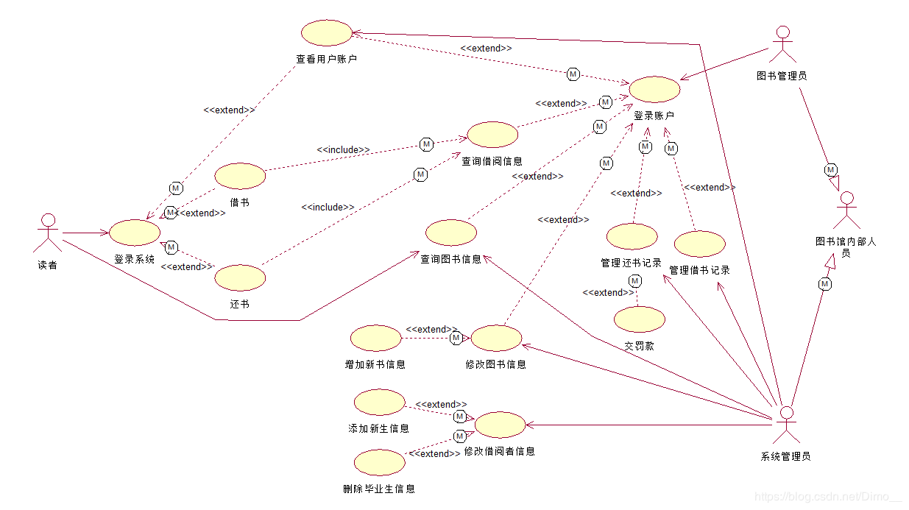
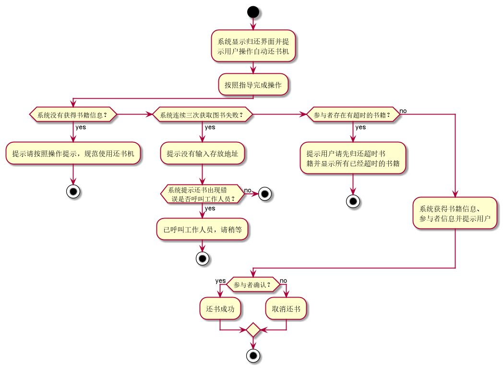
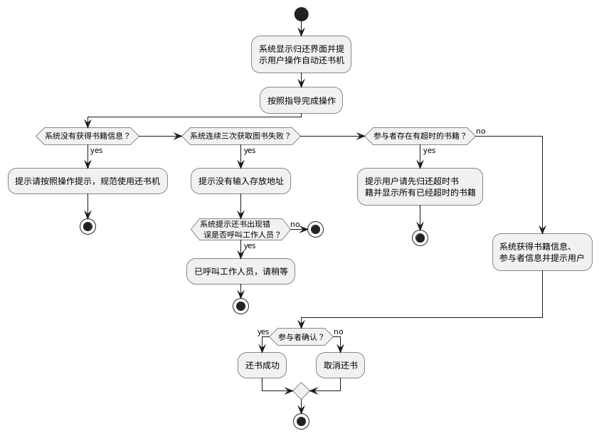

# 实验2：图书管理系统用例建模
学号|班级|姓名
:-------:|:-------:|:-------:|
201710414226|2017软件工程2班|张开轩|

### 图书管理系统的用例关系图

- 1.用例图

### 参与者说明：

- 1.图书管理员

    主要职责是：借书、还书、维护书目、管理预约、密码管理等

- 2.读者

   主要包含借书、还书、查询借阅情况、密码修改四种功能

- 3.其他访客

    只能查询浏览书籍信息

### 用例规约表

- 1.“查询图书”用例

| 用例名称 | 查询图书 |
|---|---|
|参与者|图书管理员、读者、其他访客|
|前置条件|图书管理员、读者登陆到系统，访客可不用登陆|
|后置条件|图书管理员可以浏览到书目所有借阅信息（包括借阅人、预期归还时间），读者和访客只能看到书籍信息和剩余数量|
|主事件流|1、管理员或者读者登陆系统（访客不用）  2、输入书籍名称、作者、出版社等查询  3、浏览书籍信息、状态、剩余书籍数量 |
|备选事件流|1a. 读者登陆失败   1.系统提示错误信息     2a.图书馆没有符合条件的图书   1.提示搜索的数量为0   2.返回查询首页    3a.图书馆的该种可借图书为0   1.提示可借的图书的数量为0   2.返回查询首页|

- 2.“借出图书”用例

| 用例名称 | 借出图书 |
|--- | --- |
|参与者|图书管理员（主要参与者）、读者（次要参与者）|
|前置条件|图书管理员已被识别和授权、读者登陆到系统，可借图书数目>0|
|后置条件|读者借走图书，图书馆馆藏图书减1，该编号的图书状态为借出|
|主事件流|1、管理员验证读者身份和借书条件   2、管理员将该书信息输入系统   3、查询该书状态剩余和可借数量    4、修改读者借书情况   5、将书借给读者   6、修改图书可借数目、借阅累计人数、借阅状态记录 |
|备选事件流|1a.非法读者或读者不符合借阅条件  1.系统提示错误信息并拒绝借书      1b. 读者可借书目已达上限   1.系统提示错误信息并拒绝借书    3c.读者已预约该图书  1.管理员确认信息  2.删除预定信息  |

- 3."归还图书"用例

| 用例名称 | 归还图书 |
|--- | --- |
|参与者|图书管理员（主要参与者）、读者（次要参与者）|
|前置条件|图书管理员已被识别和授权、读者登陆到系统|
|后置条件|图书馆馆藏图书加1，该编号的图书状态为可借|
|主事件流|1、管理员验证读者身份和还书条件   2、管理员将该书信息输入系统   3、查询该书状态剩余和可借数量    4、修改读者借书情况   5、将书借给读者   6、修改图书可借书目和情况 |
|备选事件流|1a.非法读者或读者没有该次借阅信息  1.系统提示错误信息     1b. 读者借阅预期   1.系统提示需要缴纳罚金    1c.读者希望续借书籍  1.管理员确认信息  2.系统跳转到续借页面  |

- 归还图书活动图

- 归还图书活动图源码

- 4."预约图书"用例

| 用例名称 | 预约图书 |
|--- | --- |
|参与者|读者（主要参与者）、图书管理员（次要参与者）|
|前置条件|读者、图书管理员已被识别和授权，且该读者现在没有预约同一本书|
|后置条件|图书馆馆藏图书不变，可借数量减一，该编号的图书状态为已被预约|
|主事件流|1、读者搜索图书   2、读者查询书籍剩余数量和状态   3、读者选择预约图书时间段  4、管理员设置读者可借数量减一，绑定借书情况  |
|备选事件流|1a.没有相应的图书  1.系统提示错误信息并拒绝预约      2a. 读者可预约书目已达上限   1.系统提示错误信息并拒绝预约    3a.读者已预约该图书  1.系统拒绝再次预约，返回预约首页 |

- 5."续借图书"用例

| 用例名称 | 续借图书 |
|--- | --- |
|参与者|读者（主要参与者）、图书管理员（次要参与者）|
|前置条件|读者、图书管理员已被识别和授权，该读者已经借阅该书，至今未超时，也未归还|
|后置条件|图书馆馆藏图书不变，该编号的图书状态为借出，且预期归还时间延后|
|主事件流|1、查询个人借书状况   2、读者查询续借书籍编号  3、读者点击续借  4、管理员确认信息  5、系统延期归还时间|
|备选事件流|1a.非法读者或读者没有借过该书籍  1.系统提示错误信息并拒绝续借      1b. 读者可续借书目已达上限或者该图书已经续借过一次   1.系统提示错误信息并拒绝续借    1c.该图书已经超出归还时间，不能续借  1.管理员审核信息 2. 读者缴纳罚金 3.读者可再次借书   4a.读者不知道怎么操作  1.点击help按钮，寻求帮助|

- 6."借阅过期罚款"用例

| 用例名称 | 借阅过期罚款 |
|--- | --- |
|参与者|读者（主要参与者）、图书管理员（次要参与者）|
|前置条件|读者、图书管理员已被识别和授权，读者逾期还书|
|后置条件|图书馆收回图书，该编号的图书状态为可借，读者可再次借阅|
|主事件流|1、管理员查询读者信息  2、读者归还图书超时且未续借  3、读者缴纳罚金  4、系统登记该次惩罚  |
|备选事件流|2a.读者已还书  1.系统提示已还书，不用罚款      2b. 读者已经缴纳完成罚金，不需要再次缴纳   1.系统提示错误信息    2c.该图书已丢失 1.管理员审核信息 2. 读者按照原价赔偿图书 3.读者缴纳过期罚金|

- 7."维护读者信息"用例

| 用例名称 | 维护读者信息 |
|--- | --- |
|参与者|图书管理员|
|前置条件|图书管理员已被识别和授权，读者信息状态正常|
|后置条件|读者信息可能发生更改，比如借阅情况、账户密码等|
|主事件流|1、管理员查询读者信息  2、管理员修改读者信息  3、管理员修改读者借阅信息  |
|备选事件流|1a.管理员登陆失败或者未被识别和授权  1.系统提示错误信息     2a. 读者密码状态或借阅状态异常   1.管理员确认信息并汇报上级解决    |

- 8."取消预约"用例

| 用例名称 | 取消预约 |
|--- | --- |
|参与者|读者（主要） 图书管理员（次要）|
|前置条件|读者登陆到系统，且该读者已经预约过该书籍|
|后置条件|图书馆馆藏数量不变，书籍编号对应书籍的状态为可借|
|主事件流|1、管理员查询读者信息  2、读者查询预约列表  3、读者取消预定  4、管理员修改书籍状态和读者借阅情况|
|备选事件流|1a.非法读者  1.系统提示密码错误，系统返回首页  2a.读者没有预约过该图书  1.系统提示错误信息|

- 9."密码修改"用例

| 用例名称 | 密码修改 |
|--- | --- |
|参与者|读者（主要） 图书管理员（次要）|
|前置条件|图书管理员登陆系统，读者登陆系统或者忘记密码|
|后置条件|读者密码变更|
|主事件流|1、读者发起修改密码请求  2、管理员验证身份  3、读者输入新密码  4、管理员变更用户密码  |
|备选事件流|2a.身份验证失败  1.系统提示密码错误，系统返回首页    4a.系统读取新密码失败    1.系统提示修改密码失败，读者可以重新操作|

- 10."管理书目"用例

| 用例名称 | 管理书目 |
|--- | --- |
|参与者| 图书管理员|
|前置条件|图书管理员登陆系统且被授权|
|后置条件|书目状态可能发生变化|
|主事件流|1、管理登陆查询图书或者浏览图书  2、管理员修改图书状态或管理员修改图书库存   |
|备选事件流|1a.管理员登陆失败  1.系统提示密码错误，系统返回首页    2a.管理员修改信息失败    1.系统提示修改失败，读者可以重新操作|

### 实验小结

本次实验熟悉了一个项目的构建过程，以及如何画用例图和活动图。用例图和活动图对一个项目的构建起到了至关重要的作用，能直观和简洁的表达一个项目要搭建哪些工程
，对简化项目开发起到了很大的作用。