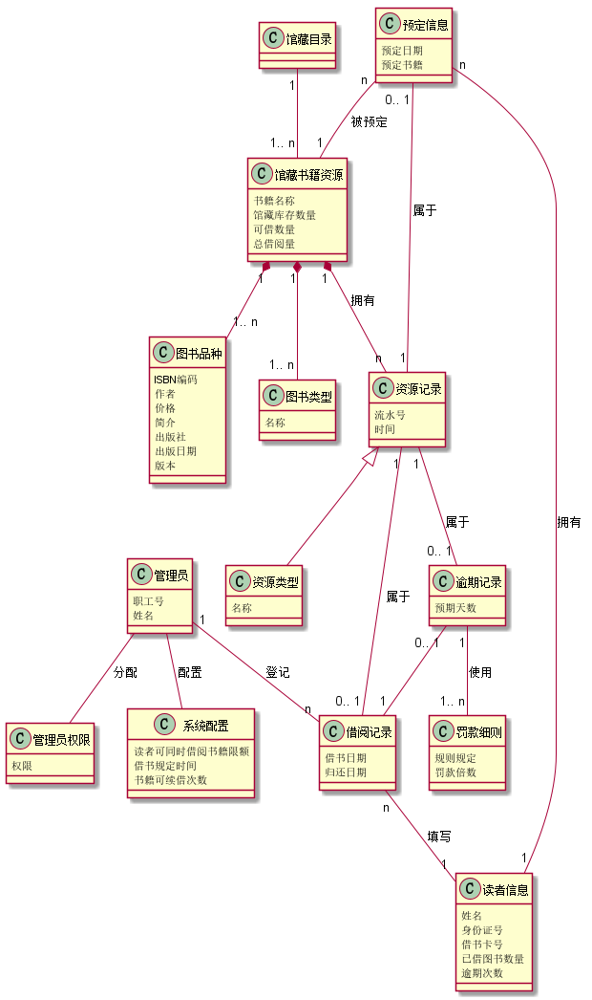
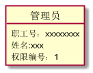
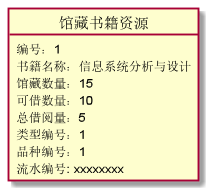
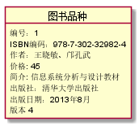
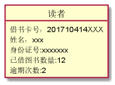
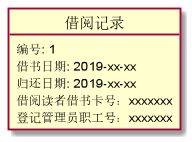

# 实验三 图书管理系统领域对象建模
学号|班级|姓名
:-------:|:-------:|:-------:|
201710414226|2017软件工程2班|张开轩|

## 1.图书管理系统的类图
### 1.1. 类图源码

```puml
@startuml
管理员  --  系统配置:配置
管理员  --  管理员权限:分配
资源记录 <|--  资源类型
馆藏目录 "1"  -- "1.. n" 馆藏书籍资源
馆藏书籍资源 "1" *-- "n" 资源记录:拥有
馆藏书籍资源  "1" *-- "1.. n" 图书品种
馆藏书籍资源  "1" *-- "1.. n" 图书类型
预定信息 "n" -- "1" 读者信息:拥有
资源记录 "1" -- "0.. 1" 预定信息:属于
预定信息 "n" -- "1" 馆藏书籍资源:被预定
资源记录 "1" -- "0.. 1" 借阅记录:属于
资源记录 "1" -- "0.. 1" 逾期记录:属于
借阅记录 "n" -- "1" 读者信息:填写
管理员 "1" -- "n" 借阅记录:登记
逾期记录 "0.. 1" -- "1" 借阅记录
逾期记录 "1" -- "1.. n" 罚款细则:使用
class 管理员{
职工号
姓名
}
class 管理员权限{
权限
}
class 系统配置{
读者可同时借阅书籍限额
借书规定时间
书籍可续借次数
}
class 资源记录{
流水号
时间
}
class 资源类型{
名称
}
class 馆藏目录{

}
class 馆藏书籍资源{
书籍名称
馆藏库存数量
可借数量
总借阅量
}
class 图书类型{
名称
}
class 图书品种{
ISBN编码
作者
价格
简介
出版社
出版日期
版本
}
class 预定信息{
预定日期
预定书籍
}
class 读者信息{
姓名
身份证号
借书卡号
已借图书数量
逾期次数
}

class 借阅记录{
借书日期
归还日期
}
class 逾期记录{
预期天数
}
class 罚款细则{
规则规定
罚款倍数
}
@enduml
```

### 1.2. 类图

### 1.3. 类型说明

1.管理员可以有多个多个权限，由系统管理员进行分配，系统管理员预置

2.系统管理员可配置图书管理系统的系统预置信息，无权限的管理员无法进行配置

3.一个图书管理员可以登记多个借书记录，每个借书记录只能属于一个读者的借阅信息

4.一个读者可以预定多本图书资源，可有多个预定记录，但一个预定记录只能预定一本图书资源

5.一个馆藏目录可以含有多个图书资源，一个图书资源只能属于一个资源记录

6.一个图书资源可以包含多种图书品种，一个图书资源可以包含多个图书类型

7.一个资源记录只能属于一种资源类型，一个资源记录只能属于一种详细记录

8.一个读者可以填写多个借阅记录，一个借阅记录只能含有0~1个逾期记录

9.一个逾期记录只能使用1~n种罚款细则
## 2. 图书管理系统的对象图
### 2.1 类"管理员"的对象图
#### 对象图源码
```puml
@startuml

object 管理员{
职工号：xxxxxxxx
姓名:xxx
权限编号：1
}

@enduml
```
#### 对象图

### 2.2 类"管理员权限"的对象图
#### 对象图源码
```puml
@startuml

object 管理员权限{
编号：1
权限：系统管理、图书管理、借阅管理
}

@enduml
```
#### 对象图

### 2.3 类"系统配置"的对象图
#### 对象图源码
```puml
@startuml

object 系统配置{
借阅限额：3
借书时间：30天
可续借次数：1
}

@enduml
```
#### 对象图

### 2.4 类"馆藏书籍资源"的对象图
#### 对象图源码
```puml
@startuml

object 馆藏书籍资源{
编号：1
书籍名称：信息系统分析与设计
馆藏数量：15
可借数量：10
总借阅量：5
类型编号：1
品种编号：1
流水编号: xxxxxxxx
}

@enduml
```
#### 对象图

### 2.5 类"图书品种"的对象图
#### 对象图源码
```puml
@startuml

object 图书品种{
编号：1
ISBN编码：978-7-302-32982-4
作者：王晓敏、邝孔武
价格: 45
简介: 信息系统分析与设计教材
出版社：清华大学出版社
出版日期：2013年8月
版本 4
}

@enduml
```
#### 对象图

### 2.6 类"图书类型"的对象图
#### 对象图源码
```puml
@startuml

object 图书类型{
编号: 1
名称: 计算机
}

@enduml
```
#### 对象图

### 2.7 类"资源记录"的对象图
#### 对象图源码
```puml
@startuml

object 资源记录{
流水编号：xxxxxxxxx
时间：2019-xx-xx
资源类型编号：1
流水绑定记录编号：1 / 1-1,1-2
}


@enduml
```
#### 对象图

### 2.8 类"资源类型"的对象图
#### 对象图源码
```puml
@startuml

object 资源类型{
编号：1
名称：书籍
编号：2
名称：借阅
}

@enduml
```
#### 对象图

### 2.9 类"预定信息"的对象图
#### 对象图源码
```puml
@startuml

object 预定信息{
预定日期: 2019-xx-xx
预定书籍数据编号: 1-1
预定读者编号：1
}

@enduml
```
#### 对象图

### 2.10 类"读者"的对象图
#### 对象图源码
```puml
@startuml

object 读者{
借书卡号：201710414XXX
姓名：xxx
身份证号:xxxxxxx
已借图书数量:9
逾期次数:0
}

@enduml
```
#### 对象图

### 2.11 类"借阅记录"的对象图
#### 对象图源码
```puml
@startuml

object 借阅记录{
编号: 1
借书日期: 2019-xx-xx
归还日期: 2019-xx-xx
借阅读者借书卡号：xxxxxxx
登记管理员职工号：xxxxxxx
}

@enduml
```
#### 对象图

### 2.12 类"逾期记录"的对象图
#### 对象图源码
```puml
@startuml

object 逾期记录{
编号: 1
预期天数：3
借阅编号：1
罚款编号：1
罚款：30
}

@enduml
```
#### 对象图

### 2.13 类"罚款细则"的对象图
#### 对象图源码
```puml
@startuml

object 罚款细则{
编号：1
规则规定：逾期3天以内
罚款倍数：1.1
}

@enduml
```
#### 对象图
