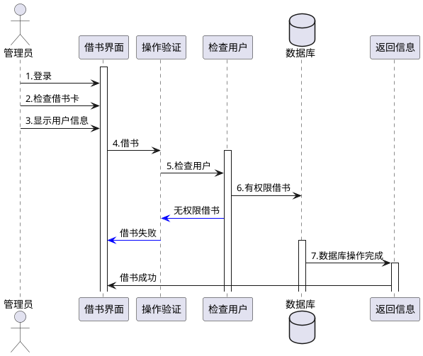
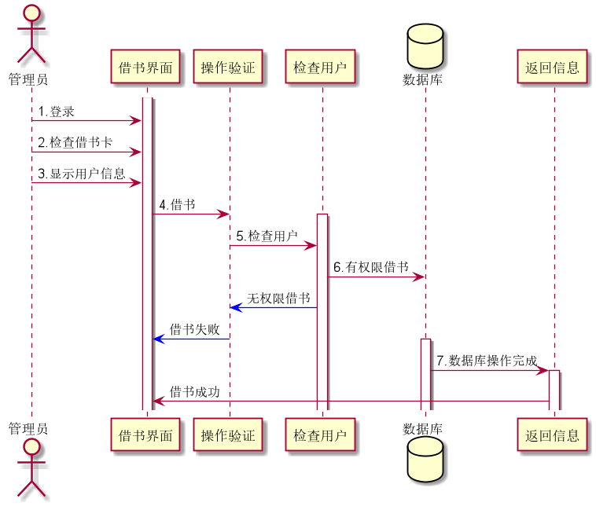
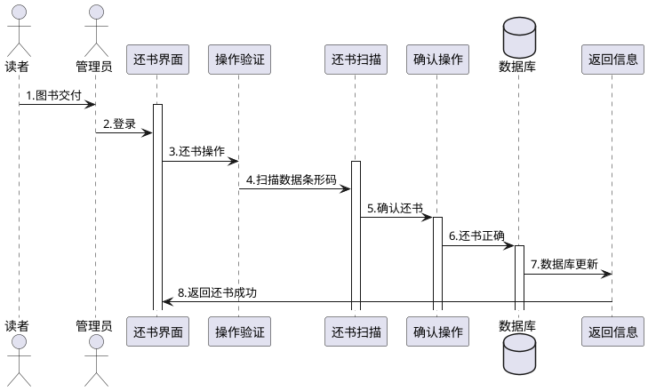
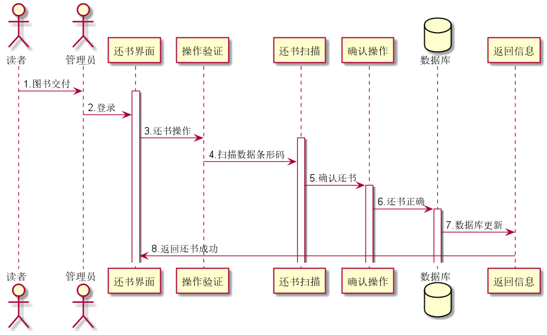
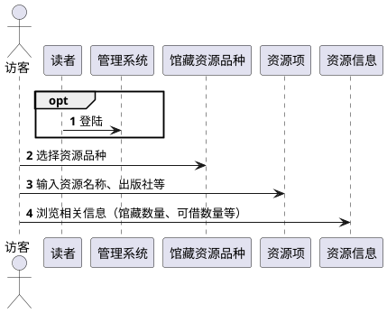
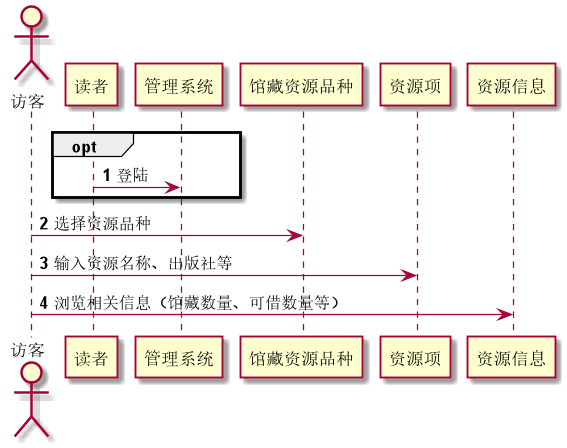
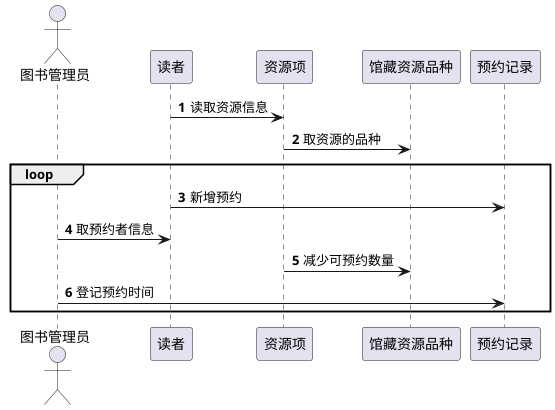
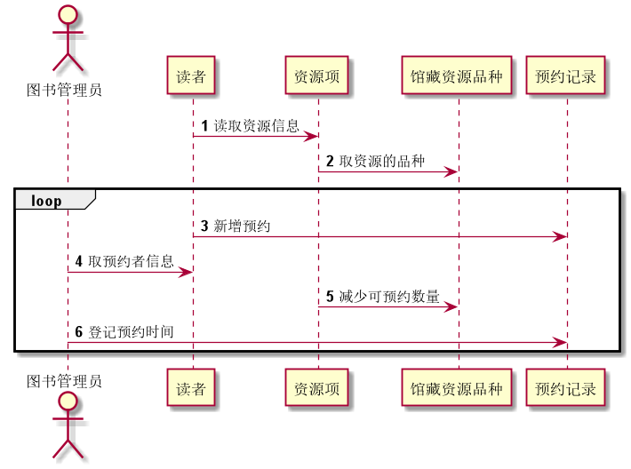

# 实验4 图书管理系统顺序图绘制

学号|班级|姓名
:-------:|:-------:|:-------:|
201710414226|2017软件工程2班|张开轩|

### 1.借书用例
####1.1 源码

####1.2 用例图

###2.还书用例
####2.1 源码

####2.2 用例图

###3.查询用例
####3.1 源码

####3.2 用例图

###4.预定用例
####4.1 源码

####4.2 用例图

###4.总结
通过本次实验， 加深了用puml代码画图的技能力，学到了顺序图，对象交互模式，消息在对象交互中的作用，以及顺序图与活动图（通常叫流程图）的区别。 

